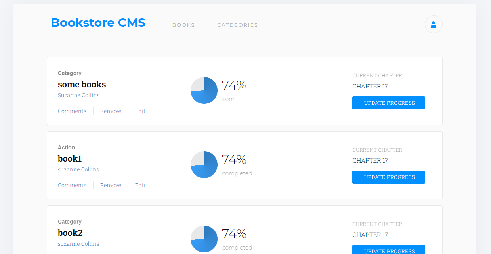

# BookStore

This React app stores books. User can add and remove books. 



Additional description of the project and its features.

## 🔴  Live Demo

[Live demo](https://bookstore-react--app.herokuapp.com/)

## Built With

- React
- Redux
- Heroku

## Getting Started

To get a local copy up and running follow these simple steps inside the root folder.

## Clone the repo:

- 'git clone' and paste https://github.com/elyor-doniyorov/bookstore-redux.git

### Setup

Install dependencies with:

```
npm install
```

### Usage

Start server with:

```
npm start
```

it will open `http://localhost:3000/` in your default browser.

## Author

👤 **Elyor Doniyorov**

- Github: [@elyor-doniyorov](https://github.com/elyor-doniyorov)
- LinkedIn: [@elyor-doniyorov](www.linkedin.com/in/elyor-doniyorov)

## 🤝 Contributing

Contributions, issues and feature requests are welcome!

Feel free to check the [issues page](https://github.com/elyor-doniyorov/bookstore-redux/issues/3).

## Show your support

Give a ⭐️ if you like this project!

## Acknowledgments

- Microverse

## 📝 License

This project is MIT Lisenced
